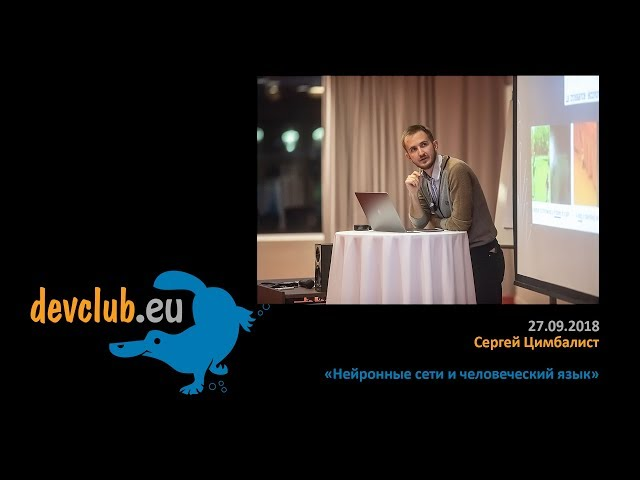

## Materials for Devclub presentation "Neural networks and Natural Language"
## Материлы по докладу "Нейронные сети и человеческий язык"

https://www.youtube.com/watch?v=R06QfCLrfXw&feature=share

## Links to blogs, papers and so on
## Ссылки на блоги, статьи и прочее

Andrew Ng's course about sequential models

Курс Andrew Ng про последовательные модели 

https://www.youtube.com/watch?v=5Vl-bK7tfD8&list=PLBAGcD3siRDittPwQDGIIAWkjz-RucAc7

Andrew Karpathy's post about Recurrent Neural Networks

Пост Andrew Karpathy про Рекуррентные Нейронные Сети
https://karpathy.github.io/2015/05/21/rnn-effectiveness/

Christopher Olah's post about LSTMs

Пост Christopher Olah про LSTM 

https://colah.github.io/posts/2015-08-Understanding-LSTMs/

Adrian Colyer's post about Word Vectors

Пост Adrian Colyer про Word Vectors 

https://blog.acolyer.org/2016/04/21/the-amazing-power-of-word-vectors/

Post about Attention mechanism

Пост про аттеншн 

https://distill.pub/2016/augmented-rnns/

Paper about Attention mechanism

Статья про аттенш 

https://arxiv.org/pdf/1706.03762.pdf

Generating human voice using Neural Networks

Генерация реалистичной человеческой речи из текста

https://ai.googleblog.com/2017/12/tacotron-2-generating-human-like-speech.html

## Code samples
## Примеры с кодом

Generating Pushkin-like poetry

Пример с генерацией стихов в стиле Пушкина

https://colab.research.google.com/drive/1SgbhBg_cP6ZuZzwxEIgO_cg749ilywzE

Simple QA system 

Пример с Q&A "Ватсон своими руками"

https://colab.research.google.com/github/sergts/simple-watson/blob/master/Watson.ipynb

## What else is there
## Чего еще посмотреть

A course about Deep Learning in Russian

Русскоязычная серия лекций про Дип Лернинг

https://www.youtube.com/watch?v=Sofqhhhei7I&index=9&list=PL5FkQ0AF9O_pTeRf6UjyfnsRbMyema6I3

Follow posts by Google - a lot about NLP

Гугл постоянно что-то выкладывает у себя в блоге, много интересного про то что связано с языком

https://ai.googleblog.com/

Short overviews of latest papers in ML, mostly about computer vision and graphics though 

Обзор последних статей в сфере ML, но больше про зрение и графику

https://www.youtube.com/user/keeroyz/videos

Lots of stuff

Куча всего

https://github.com/keon/awesome-nlp
